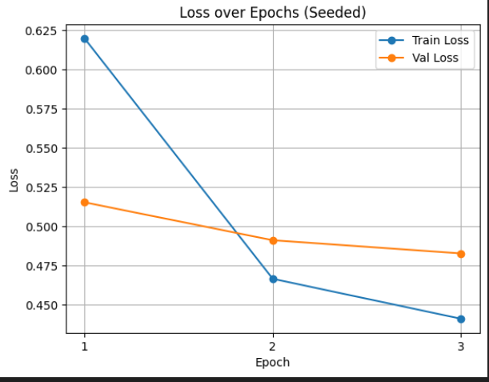
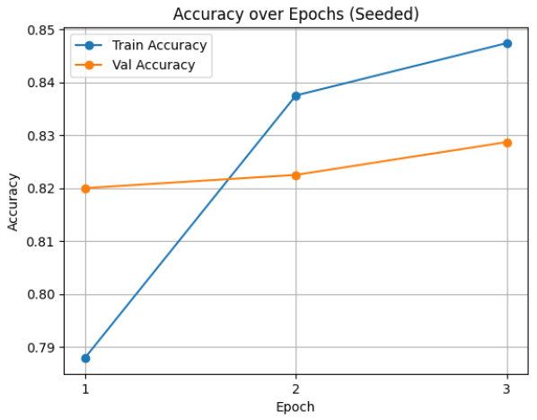
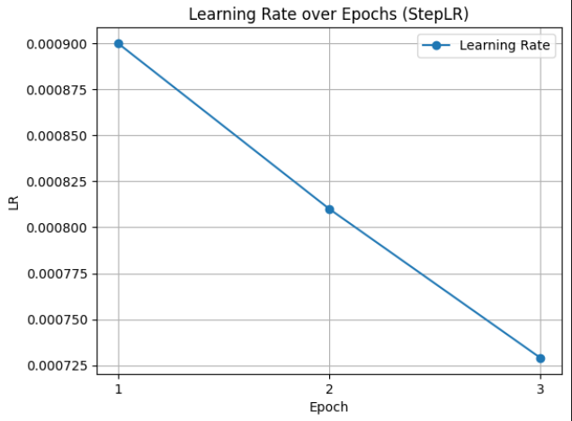

# AISE W16 – Custom Layer + Training Recipe
Learning repo for building and training a custom PyTorch layer step by step.
## 🧠 Custom PyTorch Layer + Training Recipe
This repository demonstrates:
- How to implement a simple custom PyTorch layer (LearnedAffine)
- How to integrate it into a small neural network
- How to train that network on FashionMNIST using a clean, reproducible training loop
- How to track and visualize training metrics

The goal of this project is educational: to understand how custom layers work, how training flows end-to-end, and how to make experiments reproducible and easy to inspect.

## 📁 Project Structure

aise26-w16-custom-layer-training/
├── layers.py               # Custom LearnedAffine layer
├── train.py                # Training loop (3 epochs on FashionMNIST)
├── learn_custom_layer.ipynb# Step-by-step exploration and explanations
├── tests/
│   └── test_layers.py      # Sanity check for custom layer
├── figures/                # Saved training curves
│   ├── accuracy_over_epochs.png
│   ├── learning_rate.png
│   └── loss_over_epochs.png
├── metrics.md              # What I tried, what worked, what I'd change
├── repro.md                # Exact steps to reproduce results
├── requirements.txt
└── README.md


## 🔬 Custom Layer: LearnedAffine
The custom layer implements a simple learned affine transformation:

𝑦
=
𝑥
⋅
𝛾
+
𝛽
y=x⋅γ+β

Where:
- gamma and beta are trainable parameters
- Broadcasting allows the operation to apply across batches

This layer is defined in layers.py and includes a sanity test that verifies:
- Output shape is correct
- Parameter count matches expectations

## 🏃 Training Setup
- Dataset: FashionMNIST
- Optimizer: AdamW
- Loss: CrossEntropyLoss
- Scheduler: StepLR
- Epochs: 3
- Device: CPU

Training and evaluation are properly separated using:
- model.train() during training
- model.eval() and torch.no_grad() during validation

## 📈 Training Curves
### Loss


### Accuracy


### Learning Rate


## 🔁 Reproducibility
- This project is fully reproducible.
- Fixed seed: 42
- Exact setup and commands are documented in repro.md
- Dependencies are pinned in requirements.txt

To reproduce:
```
python -m venv .venv
source .venv/Scripts/activate
pip install -r requirements.txt
python train.py
pytest -q
```

## 📝 Notes
- This project was built intentionally step-by-step to emphasize understanding over performance.
- The notebook (learn_custom_layer.ipynb) shows intermediate inspections and reasoning behind each component.
- The training run is intentionally small and CPU-only for ease of reproduction.

## 💡 What I’d Do Next
- Try OneCycleLR and compare learning dynamics
- Add batch normalization after the custom layer
- Extend training to more epochs and compare convergence
- Visualize confusion matrix for deeper evaluation